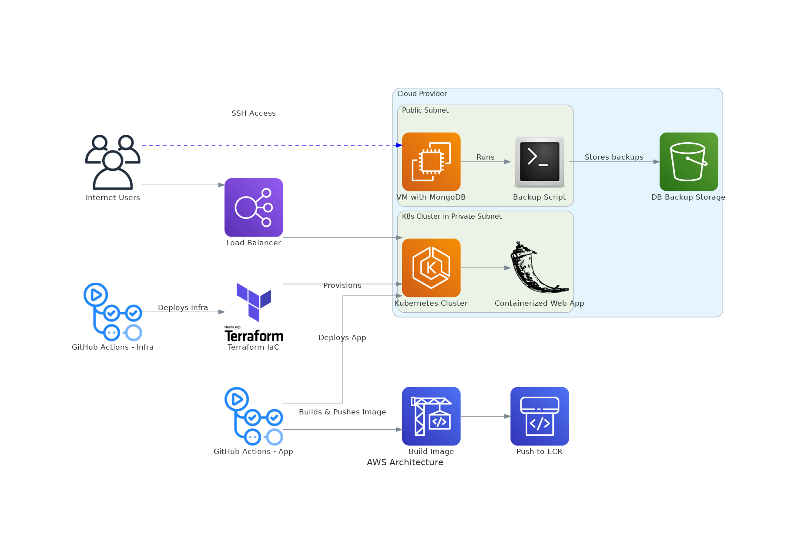

# wiz-insecurity-demo

## Architecture



## Data Flow Diagrams
 
### Diagram 1

```mermaid
graph TD;
    fe77f898-b9e9-468f-a644-9eb90b82e5a1(("External Entity: User"))
    e1276a1a-8f69-4fd0-abd7-595503908f1c["Process: Web Application"]
    431f4846-5bc1-4c9c-8292-415a51ded891[("Data Store: MongoDB Database")]

    subgraph ba1459a3-9739-4a3b-b3bc-985307482e70["User Boundary"]
        fe77f898-b9e9-468f-a644-9eb90b82e5a1
    end

    subgraph 809c4872-0257-4d86-a660-b5ebebcfcbc6["Application Boundary"]
        e1276a1a-8f69-4fd0-abd7-595503908f1c
        431f4846-5bc1-4c9c-8292-415a51ded891
    end

    subgraph 04cf4454-3f5c-440f-bd60-7658f606d921["Cloud Infrastructure Boundary"]
        e1276a1a-8f69-4fd0-abd7-595503908f1c
    end

    subgraph 1ae4e1df-ce1f-4905-bb65-88bbf19a3c6c["Security Boundary"]
        e1276a1a-8f69-4fd0-abd7-595503908f1c
    end

    fe77f898-b9e9-468f-a644-9eb90b82e5a1 -->|User Input Data| e1276a1a-8f69-4fd0-abd7-595503908f1c
    e1276a1a-8f69-4fd0-abd7-595503908f1c -->|Database Query| 431f4846-5bc1-4c9c-8292-415a51ded891
    e1276a1a-8f69-4fd0-abd7-595503908f1c -->|Application Data| fe77f898-b9e9-468f-a644-9eb90b82e5a1
    431f4846-5bc1-4c9c-8292-415a51ded891 -->|Application Data| e1276a1a-8f69-4fd0-abd7-595503908f1c
